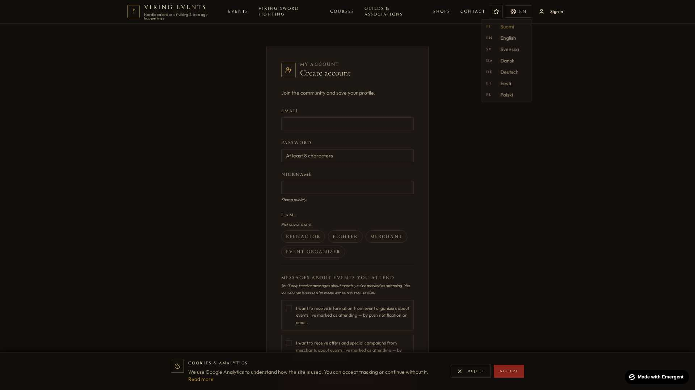
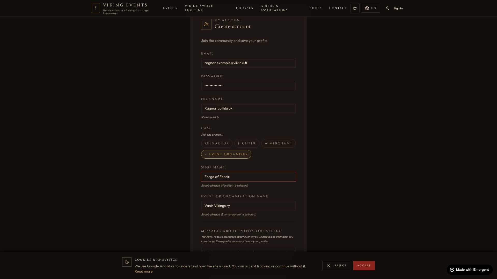
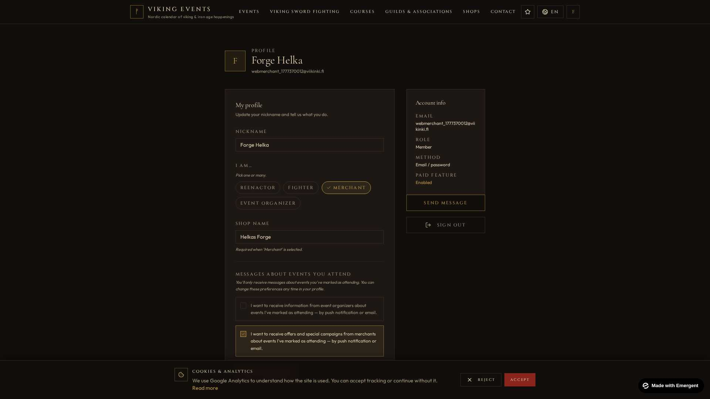
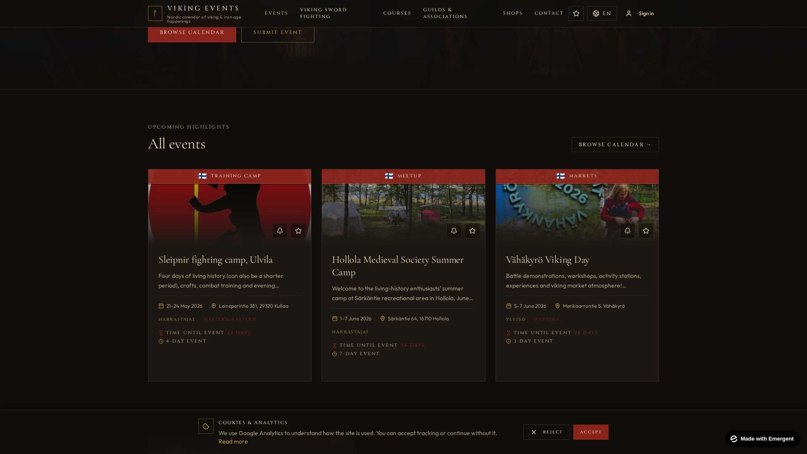
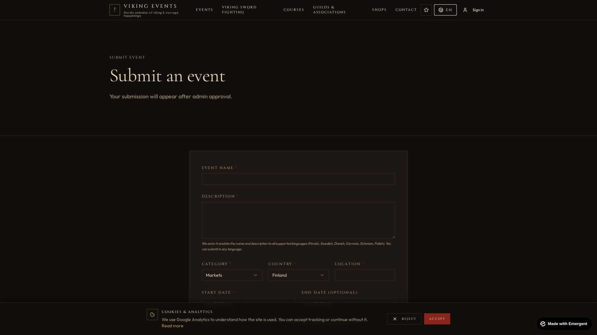
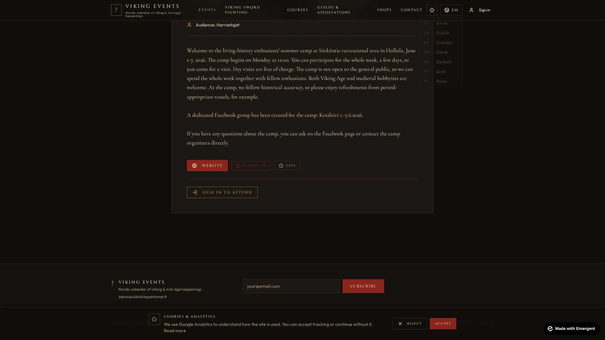
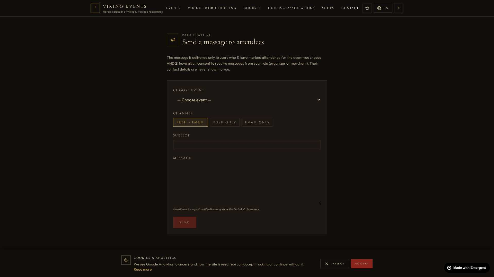

# Viking Events — User Guide

A Nordic calendar of viking and iron-age happenings — markets, battle reenactments, sword-fighting tournaments, courses, and guild meetups across Finland and the Nordic region.

This guide walks through the main features of [viikinkitapahtumat.fi](https://viikinkitapahtumat.fi).

> 🌍 **Languages**: The site is available in **Finnish, English, Swedish, Danish, German, Estonian** and **Polish**. Use the language switcher in the top-right corner of the page (the icon next to *Sign in*) to change it at any time. Your choice is remembered for the next visit.

---

## Table of Contents

1. [Creating Your Account](#1-creating-your-account)
2. [Viewing & Editing Your Profile](#2-viewing--editing-your-profile)
3. [Browsing Events](#3-browsing-events)
4. [Submitting an Event](#4-submitting-an-event)
5. [Marking Attendance to an Event](#5-marking-attendance-to-an-event)
6. [Messages from Organizers and Merchants](#6-messages-from-organizers-and-merchants)

---

## 1. Creating Your Account

Click **Sign in** in the top-right corner, then **Create account** at the bottom of the login card. Or go directly to [/register](https://viikinkitapahtumat.fi/register).

### What to fill in

| Field | Details |
|---|---|
| **Email** | Your contact address. Used for login and any password reset. We never share it with other users. |
| **Nickname** | A display name shown if you ever post or message. Free-form (e.g. *"Ragnar Lothbrok"*). |
| **Password** | Minimum **8 characters**. We hash and salt it — nobody, not even admins, can read it back. |
| **User type** *(checkboxes — pick none, one, or several)* | See the table below. |

### User types

You can be **all of these at once**. Pick whichever describes you. You can change them later from your profile.

| Role | Who picks this | What it unlocks |
|---|---|---|
| **🛡️ Hobbyist** *(default)* | Any individual interested in viking-age living history. | Browse events, RSVP, manage your own attending list. |
| **🏰 Organizer** | If you arrange events for a guild, association, or museum. | A second field appears: *Organizer name* (e.g. "Vanir Vikings ry") which is shown on the events you submit. Once approved by an admin you can [send messages](#6-messages-from-organizers-and-merchants) to your event attendees. |
| **⚒️ Merchant** | Period-correct craftspeople, smiths, weavers, mead-brewers etc. who sell wares at events. | A second field appears: *Merchant name* (e.g. "Forge of Fenrir"). Once approved you can send offers to attendees of events where your wares are relevant. |

### Notification consents

Underneath the user types you'll see two opt-in checkboxes (visible after registration in the profile page):

- ☑️ *"I want to receive information from event organizers about events I've marked as attending — by push notification or email."*
- ☑️ *"I want to receive offers and special campaigns from merchants about events I've marked as attending — by push notification or email."*

You only ever receive messages about **events you've personally marked as attending**, and only from senders whose role you've consented to. You can switch either off at any time from your profile.

After clicking **Create account** you're signed in immediately and redirected to your profile.

---

## 2. Viewing & Editing Your Profile

Click your avatar or *"Sign in"* button in the top-right and you'll land on **/profile** — your personal hub.

The page is divided into focused sections:

### Account
- **Nickname** — change anytime.
- **Roles** — toggle hobbyist / organizer / merchant on/off. If you switch off *organizer* or *merchant*, the related name field is automatically cleared.
- **Organizer name / Merchant name** — these appear publicly on events you submit, so use the legal/registered name if you have one.

### Notification preferences
Two consents covering push + email messages from organizers and merchants. Both are off by default.

### Saved search defaults
Set your usual search filters once and they're applied automatically next time you visit the events page:
- **Radius** (km from your location, e.g. 50 km)
- **Categories** (e.g. *festival, market, course*)
- **Countries** (e.g. *Finland*, *Sweden*)

### My attending events
A list of every event you've RSVPed to, with one-click access to each event's detail page. You can cancel an RSVP from the event page.

### Sign out
Bottom of the page. Clears the secure session cookie. If you forget your password, use the *"Forgot password?"* link on the login page — we email you a one-time reset link valid for 60 minutes.

---

## 3. Browsing Events

Click **Events** in the top navigation, or open [/events](https://viikinkitapahtumat.fi/events). The page offers two views — **Calendar** and **List**.

### What's in each event card

- **Country flag** + **category tag** (Festival, Market, Course, Camp, Tournament, etc.)
- **Title** — fully translated to your active language
- **Date range** (single day or multi-day camps clearly marked)
- **Location** — city/region
- **Cover image** if the organizer attached one

Click any card to open the full **event detail page**.

### Filtering

The events page supports filtering by:
- **Date** — pick a start/end range
- **Country** — Finland (default), Sweden, Estonia, Denmark, Germany, Poland
- **Category** — festival, market, fighting tournament, course, exhibition…
- **Distance** from your location (if you allow geolocation)
- **Free text** — search titles & descriptions

> 💡 If you're signed in, your **Saved search defaults** from the profile are applied automatically.

---

## 4. Submitting an Event

Click **Add event** in the top navigation, or open [/submit](https://viikinkitapahtumat.fi/submit). Anyone can submit an event — you don't need an account, though we recommend creating one so you can track your submission.

### What to fill in (Finnish only — we translate the rest!)

You only fill in the **Finnish** title and description. Our system **automatically translates** them into all six other languages (English, Swedish, Danish, German, Estonian, Polish) using AI in the background. This means:

- ✅ Your event reaches a much wider audience (~10× more reach than Finnish-only)
- ✅ You don't need to know other languages
- ✅ You can edit any translation later if you spot a wording you'd improve

### Required fields

| Field | Notes |
|---|---|
| **Title** | Short, descriptive (e.g. "Hollola Medieval Society Summer Camp") |
| **Description** | Full event description. Markdown-style line breaks supported. |
| **Date / Date range** | Single date or multi-day camps |
| **Location** | Street + city. We use Google geocoding to place it on the map. |
| **Country** | Default is Finland — change if your event is elsewhere. |
| **Category** | Pick from a fixed list (festival, market, camp, course, tournament, exhibition, etc.). |
| **Audience** | Free text describing who the event is for (e.g. *"Beginners welcome"*, *"Hobbyists only"*). |

### Optional but recommended

- **Cover image** — drag-and-drop a photo (jpg/png, up to 5 MB).
- **Website / signup link**
- **Contact email**
- **Organizer name** — auto-filled if you're logged in as an organizer.

### What happens after you submit

1. Your submission goes into the **moderation queue** with `status=pending`.
2. An admin reviews it (usually within 24 hours) and either **approves** or **rejects** it.
3. **Approved** → it appears immediately on the events page, in all 7 languages.
4. **Rejected** → you receive a short note explaining why (e.g. duplicate, wrong category, missing date).

Once approved, the event also appears in:
- the daily push reminder cron job (subscribers get a notification 3 days before the event)
- the weekly newsletter
- the iCal feed (`/api/events.ics`) so people can subscribe in their phone calendar

---

## 5. Marking Attendance to an Event

Click any event from the listing to open its detail page. Scroll past the description to find the **"Sign in to attend"** button (or **"Mark as attending"** if you're already signed in).

### When you're not signed in

You see the secondary actions:
- **Website** — opens the organizer's external page in a new tab
- **Remind me** — anonymous email reminder; we ask only for an email address and send a one-off mail 3 days before the event. No account required.
- **Save** — bookmark to your browser favourites (uses localStorage, doesn't need an account).

…plus a yellow banner: **"Sign in to attend"**. Click it to log in or create an account, then return automatically to this event.

### When you're signed in

The button changes to **Mark as attending**. Click it and you'll see two notification preference toggles:

- 📲 **Push notification** — we send a push notification to your phone (if the mobile app is installed) the day before the event with directions and weather.
- 📧 **Email reminder** — we email you 3 days before with the same info.

Both default to **on**, but you can turn either off independently. Your global consent settings (from your [Profile](#2-viewing--editing-your-profile)) act as an additional gate — for example, if you've turned off all merchant offers in your profile, no merchant can message you about this event regardless of what's set here.

### Cancelling

Click **Attending — cancel** to remove your RSVP. You can re-add it any time.

### Where can I see my attending list?

Open your [Profile](#2-viewing--editing-your-profile) → *My attending events* section. Past events fade automatically once their date passes.

---

## 6. Messages from Organizers and Merchants

If you've **marked attendance** for an event AND **opted in** to a sender's role (organizer or merchant), the sender can reach you with relevant updates.

### From your perspective (attendee)

- 🔔 **Push notifications** appear on your phone via the mobile app.
- 📧 **Emails** arrive at the address used at registration.
- All messages tell you which **event** they're about and **who sent them**. You can opt out of further messages at any time from your profile.
- You **never see the sender's full contact list** — and they never see yours. Privacy is enforced by the backend.

### From the sender's perspective (organizer / merchant)

If your account has *organizer* or *merchant* type AND an admin has enabled your **paid messaging** flag, you'll see a **Send message** link in your profile. The form is on `/messages`:

#### How it works

1. **Choose event** — only events you've created (or that you're listed as the organizer of) appear in the dropdown.
2. **Channel** — *Push + Email* (recommended), *Push only*, or *Email only*. Tip: keep messages **concise** — push notifications only show the first ~160 characters.
3. **Subject** — the headline. Shown as the push title.
4. **Message** — the full body. Both languages of the event are auto-included.
5. Click **Send**.

Behind the scenes, the system filters recipients to only those who:
- have RSVPed to the event
- have given consent to your specific role (organizer or merchant)
- have the matching channel toggle (push and/or email) enabled on their RSVP

You then see a confirmation: *"Sent to N recipients"* — that's the only stat shown. **Names, emails, push tokens, and contact details are never visible to you.**

#### Audit trail (organizers only)

Every message you send is logged for transparency. You can see your own send history from `/messages` (count + subject + date). Admins also see this for the full site to ensure abuse-free use.

---

## Quick Reference

| Action | Where |
|---|---|
| Create account | [/register](https://viikinkitapahtumat.fi/register) |
| Sign in / out | Top-right corner |
| Edit profile | [/profile](https://viikinkitapahtumat.fi/profile) |
| Browse events | [/events](https://viikinkitapahtumat.fi/events) |
| Submit a new event | [/submit](https://viikinkitapahtumat.fi/submit) |
| Mark attendance | Event detail page → *Mark as attending* |
| Send message to attendees | [/messages](https://viikinkitapahtumat.fi/messages) (organizers/merchants only) |
| Forgot password | [/forgot-password](https://viikinkitapahtumat.fi/forgot-password) |
| Subscribe to monthly newsletter | Footer of any page |
| Subscribe to iCal feed | `webcal://viikinkitapahtumat.fi/api/events.ics` |

---

## Mobile App

The same features (browse, search, mark attendance, receive push notifications, view your saved list) are available in the **Viking Events** mobile app for Android (and soon iOS). Search "Viikinkitapahtumat" in the Google Play Store, or scan the QR code on the website footer.

---

## Need help?

- Email: `admin@viikinkitapahtumat.fi`
- Privacy policy: [/privacy](https://viikinkitapahtumat.fi/privacy)
- Terms of service: [/terms](https://viikinkitapahtumat.fi/terms)

May the gods favour your gathering. 🛡️
